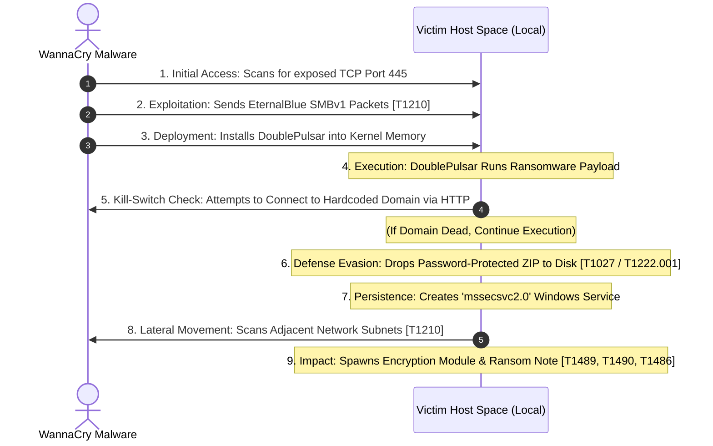

<h1 style="color:#33aaff;">Threat Intelligence Report: WannaCry Ransomware</h1> 

<br>

<h2>Executive Dashboard</h2>

| Classification | Description | 
| :--- | :--- | 
| Threat | WannaCry Ransomware | 
| Attack Date | May 12, 2017 | 
| Severity | <code style="color : red"> Critical </code> | 
| Attribution | Lazarus Group (APT 38) | 
| Objective | File Encryption & Extortion | 
| Impact | 250,000+ Systems Affected | 
| Exploit | EternalBlue (CVE-2017-0144) | 
| Mitigation | MS17-010, Disable SMBv1 | 

<br>

---

<br> 

<h2>Executive Summary</h2>

This assessment analyzes the WannaCry ransomware attack through the lens of threat intelligence and the MITRE ATT&CK framework to identify adversary behaviors, IoCs, and defensive measures. The attack occurred on May 12, 2017 and is attributed to the North Korean state-sponsored threat group **Lazarus (APT38)**. The ransomware spread rapidly across vulnerable Microsoft Windows systems by exploiting the ***EternalBlue (CVE-2017-0144)*** vulnerability within the Server Message Block (SMBv1) protocol over port 445. Once executed, WannaCry encrypted the victims' files and demanded payment in Bitcoin in exchange for decryption keys. Hours later, the discovery and registration of a hardcoded kill-switch domain put an end to the global attack.

WannaCry impacted **250,000+ computers worldwide** across critical infrastructures such as healthcare, government agencies, and private enterprises, causing massive operational disruption, financial losses, and service outages. Analysis of the malware demonstrates the use of multiple MITRE ATT&CK techniques across the *Initial Access*, *Execution*, *Lateral Movement*, *Defense Evasion*, and *Impact* phases.

<br>

<h3>🔴 Immediate Response</h3>

&nbsp;&nbsp;&nbsp;&nbsp;▢ Isolate infected hosts from network <br>
&nbsp;&nbsp;&nbsp;&nbsp;▢ Block TCP 445 <br>
&nbsp;&nbsp;&nbsp;&nbsp;▢ Deploy IDS/IPS signatures <br>
&nbsp;&nbsp;&nbsp;&nbsp;▢ Preserve evidence <br>


<h3>🟡 Strategic Hardening</h3>

&nbsp;&nbsp;&nbsp;&nbsp;▢ Disable SMBv1 <br>
&nbsp;&nbsp;&nbsp;&nbsp;▢ Apply MS17-010 <br>
&nbsp;&nbsp;&nbsp;&nbsp;▢ Segment networks <br>
&nbsp;&nbsp;&nbsp;&nbsp;▢ Validate backups <br>
&nbsp;&nbsp;&nbsp;&nbsp;▢ Deploy EDR <br>
  
---

<h2>Key Findings</h2>

| Category | Assessment |
| :--- | :--- | 
| Malware Family | WannaCry, WannaCrypt, WanaCryptOr 2.0 | 
| Threat Type | Ransomware | 
| Initial Access | Exploitation of SMBv1 Vulnerability over port 445 | 
| Exploit Used | EternalBlue (CVE-2017-0144) | 
| Propagation Method | Self-propagating behavior | 
| Primary Objective | File Encryption & Ransom Payment | 
| Public Attribution | Lazarus Group (APT 38) | 
| Impact Level | Critical | 
| Kill Switch | Registered domain that halted spread | 

---

<br> 

<h2>Attack Timeline</h2>

&nbsp;&nbsp;*April 2017* <br>
│ <br>
├── Shadow Brokers leak NSA tool, EternalBlue <br>
│ <br>
&nbsp;&nbsp;*May 12, 2017* <br>
│ <br>
├── WannaCry infections begin spreading globally <br>
│ <br>
├── Global SMB propagation through EternalBlue exploit <br>
│ <br>
├── Files were encrypted and victims presented with ransom demands <br>
│ <br>
&nbsp;&nbsp;*Containment Achieved* <br>
│ <br>
├── Kill switch discovered by Marcus Hutchins <br>
│ <br>
└── MS17-010 released by Microsoft <br>

<br> 

---

<h2>Attack Flow</h2>



---

<br> 

## [MITRE ATT&CK Matrix Mapping](https://attack.mitre.org/)

<br> 

| **Tactic** | **Technique ID** | **Technique Name** | **Behavior** | 
| :--- | :--- | :--- | :--- |
| Initial Access | [T1190](https://attack.mitre.org/techniques/T1190/) | Exploit Public-Facing Application | WannaCry gained access through the SMBv1 vulnerability exposed on vulnerable systems through port 445. |  
| Lateral Movement | [T1210](https://attack.mitre.org/techniques/T1210/) | Exploitation of Remote Services | WannaCry contains a thread that will attempt to scan for new attached drives every 10 seconds. If one is identified, it will encrypt the files on the attached device. |       
| Defense Evasion | [T1222.001](https://attack.mitre.org/techniques/T1222/) | File & Directory Permissions Modification: Windows Permissions | Executes `attrib +h` & `icacls . /grant Everyone:F /T /C /Q` to override standard Windows access control lists by making some of its files hidden and granting all users full access controls. | 
| Impact | [T1486](https://attack.mitre.org/techniques/T1486/) | Data Encrypted for Impact | Scans local and mapped network drives, encrypts a massive list of business-critical file extensions using AES-128 and RSA-2048 encryption algorithms, leaving a `.WNCRY` file extension. | 
| Impact | [T1489](https://attack.mitre.org/techniques/T1489/) | Service Stop | WannaCry attempts to kill processes associated with Exchange, Microsoft SQL Server, and MySQL to make it possible to encrypt their data stores. | 
| Impact | [T1490](https://attack.mitre.org/techniques/T1490/) | Inhibit System Recovery | WannaCry uses `vssadmin`, `wbadmin`, `bcdedit`, and `wmic` (native system tools) to delete and disable operating system recovery features. These actions reduced the likelihood of successful recovery without paying the ransom. |  

<br> 

---

<h2 style="color:#D4A017;">Threat Intelligence & MITRE ATT&CK Alignment</h2>

### Core Observed Behavior: 
* Network scanning 
* Automated exploitation 
* Self-propagation 
* Rapid lateral movement across internal subnets 

### Command Line Artifacts: 
``` bash
attrib +h
# hide malicious files from users    

icacls . /grant Everyone:F /T /C /Q
# override standard permission restrictions (ACLs)  
```
---

<h2 style="color:#D4A017;">Incident Response Recommendations</h2>

*If a WannaCry infection is identified:* <br>

### Immediate Actions 
1. Disconnect affected hosts from the network.
2. Isolate infected systems.
3. Identify additional vulnerable devices.
4. Preserve forensic evidence.
5. Block known malicious indicators.
6. Apply Microsoft security patches (*MS17-010*).
7. Review backup integrity before restoration.

### Long-Term Defenses 
* Stay ahead of vulnerabilities with a fast patch management process. 
* Disable SMBv1 where possible. 
* Segment internal networks. 
* Employ endpoint detection and response (EDR).
* Conduct regular backup validation. 
* Monitor for lateral movement activity. 

---

<h2 style="color:#D4A017;">Malware Binaries</h2>

A quick-reference database of high-fidelity SHA-256 and MD5 hashes that security tools can scan for in endpoint logs to look for the presence of the WannaCry dropper and its core components. <br> 

| Indicator Type | Cryptographic Hash Value | Artifact Description | 
| --- | --- | --- | 
| SHA-256 | ed01ebfbc9eb5bbea545af4fedebd50cba32d559101d0f7428b0d3e81e1e212b | Primary Dropper & Worm Module | 
| SHA-256 | 84c82835a5d21bbcf75a61706d8ab549ae03c537c17153d1ec97b047854522a1 | Ransomware Encryption Orchestrator | 
| MD5 | db349b97c37d22f5ea1d1841e3c89eb4 | Primary Dropper & Worm Module | 
| MD5 | b9c5d433919d77d9228c78ad847d0784 | Ransomware Encryption Orchestrator | 

<br>

### Network & Infrastructure Indicators 
* **Target Ports:** TCP Port 445 (SMB) 
* **Kill-Switch Domain Check:** Outbound HTTP requests over port 80 to:
``` bash 
://iuqerfsodp9ifjaposdfjhgosurijfaewrwergwea.com
```
* **Outbound Signatures:** Unauthorized outbound routing to Tor networks utilizing non-standard destination ports to connect with `.onion` payment verification gateways. 

### Host-Based Artifacts 
* **Created Windows Service:** `mssecsvc2.0`. Display Name: Microsoft Security Center (2.0) Service 
* **Ransom File Extension:** Appends `.WNCRY` to all successfully targeted files. 
* **File Encryption Manager:** `tasksche.exe` searches local file system for specific file extensions, generates AES keys, and begins scrambling the data into `.WNCRY` files. 
* **Dropped Ransom Note:** Creates text files named: `@Please_Read_Me@.txt`.
  
---

> <h2>Analyst Assessment</h2>
> WannaCry demonstrates how a single unpatched vulnerability can escalate into global operational disruptions across critical infrastructures. Analyzing WannaCry provides a practical baseline for utilizing the MITRE ATT&CK framework to map adversary behavior, optimize detection rules, and reinforce organizational resilience.


